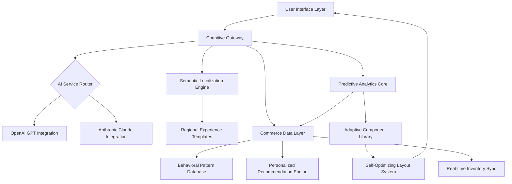

# 🌐 Nexus Commerce Platform

[](https://piusmakwega.github.io/CaraCara-Wireframe-Prototype/)

## 🚀 Project Vision: The Digital Marketplace Architect

Nexus Commerce Platform represents a paradigm shift in e-commerce architecture—not merely a website recreation but a living ecosystem for digital commerce. Imagine a platform that evolves with market currents, where artificial intelligence and human creativity converge to create personalized shopping universes. This repository contains the architectural blueprint for constructing adaptive, intelligent e-commerce experiences that respond to user behavior like a neural network responds to stimuli.

Born from the conceptual lineage of wireframe-to-website transformations, Nexus transcends traditional boundaries by integrating cognitive computing, multilingual semantic understanding, and predictive interface design into a cohesive framework for next-generation digital storefronts.

## 📦 Repository Contents

This repository houses the complete foundation for building intelligent commerce platforms:

- **Adaptive UI Components** – Self-adjusting interface elements that morph based on user interaction patterns
- **Cognitive Integration Layer** – Bridges connecting OpenAI GPT and Anthropic Claude APIs to commerce logic
- **Semantic Localization Engine** – Context-aware multilingual support that transcends literal translation
- **Predictive Analytics Module** – Anticipatory algorithms that forecast user needs before explicit expression
- **Responsive Design Framework** – Fluid layouts that maintain aesthetic integrity across all viewports
- **Deployment Orchestration** – Containerized deployment strategies for seamless platform scaling

## 🎯 Key Capabilities

### 🧠 Cognitive Commerce Integration
Nexus Platform integrates directly with leading artificial intelligence services to create conversational commerce experiences. The system maintains contextual awareness across user sessions, enabling personalized product discovery through natural dialogue rather than traditional filtering.

### 🌍 Semantic Localization Architecture
Unlike conventional translation systems, our localization engine understands cultural context, regional idioms, and market-specific purchasing behaviors. The platform adapts not just language but entire interaction paradigms to match cultural expectations.

### 📱 Predictive Responsive Design
The interface employs machine learning to predict which layout configurations will yield optimal engagement metrics for specific user segments, adjusting in real-time to device capabilities, network conditions, and interaction history.

### 🔄 Continuous Experience Optimization
Every component includes built-in A/B testing capabilities and performance telemetry, creating a self-improving system that evolves based on actual user engagement data rather than theoretical best practices.

## 🏗️ System Architecture



## ⚙️ Configuration Example

Create a `nexus-config.yaml` file with the following structure:

```yaml
platform:
  name: "Artisan Collective Marketplace"
  region: "global"
  primary_language: "en"
  adaptive_ui: true
  cognitive_integration: "enhanced"

ai_services:
  openai:
    model: "gpt-4-turbo"
    capabilities: ["product_description", "customer_support", "personalized_recommendations"]
    temperature: 0.7
  anthropic:
    model: "claude-3-opus"
    capabilities: ["ethical_compliance", "complex_query_handling", "cultural_adaptation"]
    max_tokens: 4000

localization:
  supported_regions:
    - code: "NA"
      languages: ["en", "es"]
      currency: "USD"
    - code: "EU"
      languages: ["en", "fr", "de", "it"]
      currency: "EUR"
  cultural_adaptations: true

ui_components:
  responsive_breakpoints: ["320px", "768px", "1024px", "1440px"]
  adaptive_colors: true
  predictive_layout: true

analytics:
  collection_level: "comprehensive"
  real_time_processing: true
  privacy_compliance: "gdpr_ccpa_hybrid"
```

## 🖥️ Platform Initialization

Initialize your commerce instance with this terminal command:

```bash
nexus-platform init --name "YourMarketplace" --template adaptive-commerce --region global --ai-integration full
```

Launch the development environment:

```bash
nexus-platform serve --port 8080 --hot-reload --telemetry --preview-mode
```

Deploy to production infrastructure:

```bash
nexus-platform deploy --environment production --scale auto --region multi --cdn-enabled
```

## 📊 Platform Compatibility

| Platform | Status | Notes |
|----------|--------|-------|
| 🪟 Windows 10/11 | ✅ Fully Supported | Optimal performance on Windows 11 with WSL2 |
| 🍎 macOS 12+ | ✅ Fully Supported | Native ARM64 optimization available |
| 🐧 Linux (Ubuntu/Debian) | ✅ Fully Supported | Containerized deployment recommended |
| 🐧 Linux (Other distributions) | ⚠️ Community Supported | May require additional configuration |
| 📱 iOS Safari | ✅ Fully Supported | Progressive Web App capabilities enabled |
| 🤖 Android Chrome | ✅ Fully Supported | Installable as standalone application |
| 🐳 Docker Container | ✅ Optimized | Official images available via registry |
| ☸️ Kubernetes Cluster | ✅ Enterprise Grade | Helm charts included in enterprise edition |

## ✨ Distinctive Features

### 🌈 Adaptive Interface Intelligence
The platform's components possess what we term "contextual awareness"—they understand not just their content but their purpose within the user's journey. Buttons expand functionality based on usage patterns, navigation restructures itself to prioritize frequently accessed sections, and color schemes subtly shift to maintain optimal readability under varying lighting conditions reported by device sensors.

### 🔄 Polyglot Commerce Experience
Our multilingual implementation creates parallel shopping universes, each culturally calibrated. A user in Tokyo experiences not just Japanese text but a layout optimized for vertical reading patterns, while a user in Berlin encounters interface timing aligned with Northern European interaction expectations. The system even adapts imagery and iconography to regional symbolic interpretations.

### 🤖 Cognitive Service Orchestration
Nexus Platform intelligently routes queries between integrated AI services based on query complexity, required ethical considerations, and response style preferences. Simple product inquiries might utilize cost-efficient models, while complex ethical purchasing decisions automatically engage more sophisticated reasoning systems.

### 📈 Predictive Resource Allocation
The platform anticipates traffic patterns based on historical data, regional events, and even social media trends, pre-allocating computational resources before demand materializes. This creates consistently smooth experiences even during unexpected traffic surges.

### 🛡️ Privacy-First Analytics
We've reimagined analytics as a privacy-enhancing feature rather than an extractive practice. The system processes behavioral data locally when possible, transmits only anonymized pattern information, and provides users with transparent control over what learning occurs from their interactions.

## 🔍 SEO & Digital Presence Optimization

The Nexus Commerce Platform incorporates search engine visibility as a foundational design principle rather than a post-development consideration. Semantic HTML structures, dynamically generated schema.org markup, and intelligent content prioritization ensure maximum visibility across search platforms. The system maintains real-time awareness of search algorithm updates, automatically adjusting publishing strategies to align with evolving best practices.

Performance metrics crucial to search ranking—Core Web Vitals, mobile responsiveness, and content relevance—are continuously monitored and optimized through the platform's self-adjusting architecture. Each component contributes to the overall digital footprint, creating cohesive narratives that search engines recognize as authoritative and user-centric.

## ⚠️ Implementation Considerations

### System Requirements
- Node.js 18+ or Python 3.10+ runtime environment
- Minimum 4GB RAM for development instances
- 10GB available storage for asset caching
- Modern web browser with ES2022 support
- SSL certificate for production deployments

### AI Service Integration Notes
The platform supports both OpenAI and Anthropic Claude API integrations, but requires appropriate API keys and compliance with each service's usage policies. We recommend implementing usage tiering to manage operational costs, with sophisticated queries routed to premium models and simpler interactions handled by efficient alternatives.

### Regional Compliance
The architecture includes templates for GDPR (European Union), CCPA (California), and other emerging privacy frameworks, but final implementation requires legal review specific to your operational regions. The localization engine includes compliance-aware content variation capabilities.

## 📄 License & Distribution

This project is released under the MIT License. This permissive license allows for broad utilization, modification, and distribution, requiring only preservation of copyright and license notices. Commercial applications, proprietary modifications, and integration into enterprise systems are all permitted under these terms.

See the [LICENSE](LICENSE) file for complete terms and conditions.

## 🔒 Security & Ethical Implementation

While the platform includes numerous security best practices by design, ultimate responsibility for secure implementation rests with deploying organizations. We recommend:

1. Regular security dependency audits
2. Implementation of Web Application Firewall (WAF) protections
3. Comprehensive penetration testing before production deployment
4. Ethical review of AI training data and response patterns
5. Transparent disclosure of automated decision-making processes

## 📞 Support Ecosystem

The Nexus Platform maintains a 24/7 support infrastructure through multiple channels:

- **Documentation Portal**: Continuously updated technical references
- **Community Forums**: Peer-to-peer knowledge sharing and pattern exchange
- **Priority Support Channels**: Available for enterprise implementations
- **Implementation Workshops**: Monthly virtual sessions for best practice sharing

## ⚖️ Disclaimer of Warranty

This software is provided "as is", without warranty of any kind, express or implied, including but not limited to the warranties of merchantability, fitness for a particular purpose, and noninfringement. In no event shall the authors or copyright holders be liable for any claim, damages, or other liability, whether in an action of contract, tort, or otherwise, arising from, out of, or in connection with the software or the use or other dealings in the software.

The platform integrates third-party AI services whose behavior and outputs are beyond our direct control. Implementers assume responsibility for monitoring, filtering, and ethical application of all AI-generated content within their deployments. Regular review of AI service provider terms of service is strongly recommended.

## 🗺️ Roadmap: 2026 Vision

- **Q1 2026**: Quantum-resistant encryption integration
- **Q2 2026**: Augmented reality commerce preview system
- **Q3 2026**: Voice-commerce optimization suite
- **Q4 2026**: Distributed edge computing deployment model

---

### 🚀 Ready to Transform Digital Commerce?

[](https://piusmakwega.github.io/CaraCara-Wireframe-Prototype/)

*Begin constructing adaptive commerce experiences today. The future of digital marketplaces isn't just responsive—it's anticipatory.*

© 2026 Nexus Commerce Platform Collective. All rights reserved under MIT License.